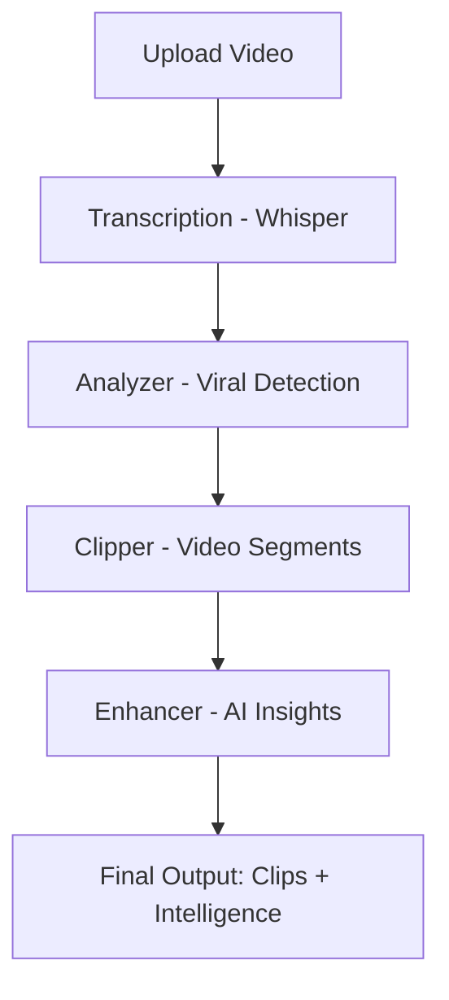

# 🚀 WhyViral AI

### Turn Long Videos into Viral Moments — with Intelligence


---

## 🖥️ Video Demo

🎬 **Live Demo Video (MANDATORY)**
👉 (https://drive.google.com/file/d/1sg7uCLqF5dq-UHX8Oc35gSD4aN09loay/view?usp=sharing)

## 🖥️ Deployed Link
🎬 **Live Deployed Link (MANDATORY)**
👉 (https://whyviralai.streamlit.app/)

---

## 🎯 Problem

In the creator economy, **attention is everything** — but:

* Long-form videos are hard to optimize
* Viral moments are hidden inside hours of content
* Creators don’t know *why* something works

---

## 💡 Solution — WhyViral AI

**WhyViral AI** is an intelligent system that:

* 🎥 Extracts **viral clips** from long videos
* 🧠 Explains **WHY** they are engaging
* 🚀 Suggests **hooks, captions, and improvements**

> We don’t just clip content — we **optimize it for virality**

---

## ⚙️ Core Features

✨ **AI-Powered Clip Detection**
Automatically identifies high-impact moments

🔥 **Virality Scoring (0–10)**
Quantifies engagement potential

🧠 **Explainability Layer**
Tells *why* a clip works (emotion, relatability, etc.)

🚀 **Hook Generator**
Creates scroll-stopping opening lines

✍️ **Caption Generator**
Produces ready-to-post captions

📈 **Engagement Tips**
Actionable improvements (editing, pacing, visuals)

---

## 🧠 How It Works



---

## 🖥️ Video Demo

🎬 **Live Demo Video (MANDATORY)**
👉 (https://drive.google.com/file/d/1sg7uCLqF5dq-UHX8Oc35gSD4aN09loay/view?usp=sharing)

## 🖥️ Deployed Link

👉 (https://whyviralai.streamlit.app/)

---

## 📸 Sample Output

```text
🎥 Clip 1

🔥 Score: 6.2/10

🧠 Why:
- Emotional resonance
- Personal storytelling
- Relatable content

🚀 Hook:
"I wish someone told me this earlier"

✍️ Caption:
"The lesson you needed right now."

📈 Tips:
- Add zoom on key sentence
- Use jump cuts
- Add emotional pause
```

---

## 🏗️ Project Structure

```bash
WhyViral/
│
├── modules/
│   ├── transcribe.py    # Speech → text (Whisper)
│   ├── analyzer.py      # Viral segment detection
│   ├── clipper.py       # Video clipping
│   ├── enhancer.py      # AI insights generation
│
├── outputs/clips/       # Generated clips
├── app.py               # Streamlit UI
├── sample.mp4           # Demo video
├── requirements.txt
└── README.md
```

---

## ⚡ Tech Stack

* **Python**
* **Streamlit (Frontend UI)**
* **OpenAI Whisper (Speech-to-text)**
* **MoviePy (Video Processing)**
* **Custom AI Logic (Heuristic + NLP)**

---

## 🚀 Getting Started

### 1️⃣ Clone Repository

```bash
git clone https://github.com/your-username/whyviral-ai.git
cd whyviral-ai
```

### 2️⃣ Install Dependencies

```bash
pip install -r requirements.txt
```

### 3️⃣ Run the App

```bash
streamlit run app.py
```

---

## 🧠 What Makes Us Unique

Most tools:
❌ Just clip videos

**WhyViral AI:**
✅ Finds viral moments
✅ Explains *why* they work
✅ Suggests *how to improve them*

> We bridge the gap between **analysis → optimization**

---

## 🎯 Use Cases

* 🎬 Content Creators
* 📱 Influencers / Reels / Shorts
* 📢 Marketers
* 🎓 Educational Content
* 🎥 YouTubers

---

## 🏆 Hackathon Fit

Aligned with:

* AI + Multimodal Processing
* Creator Economy
* Real-world Product Thinking
* End-to-End Pipeline

---

## 🔮 Future Improvements

* 🎵 Audio-aware scoring
* 🧑‍💻 Face/emotion detection (CV)
* ☁️ Cloud deployment
* 📊 Engagement prediction model
* 🎨 Auto-editing (captions, zooms)

---

## 👨‍💻 Team

* Sudarshan Maddi
  *(Add teammates if any)*

---

## 📜 License

MIT License

---

## ⭐ Final Note

> In a world of infinite content,
> **attention is the real currency.**

WhyViral helps you **earn it.**
